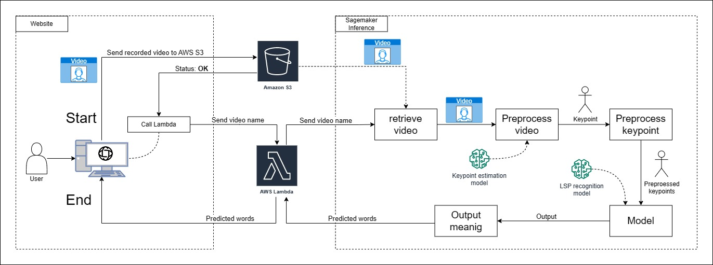

# Inference we try

* Lambda (deprecated)
* Sagemaker with ECR (ECR)
* Sagemaker without ECR (NoECR)

# Lambda

we worked with two models "m-decoster" and "Smile-lab" model. we do not use this due to the cold start it needs.

# Sagemaker with ECR

We prepared a dockerfile to use the model "Smile-lab" and "Spoter" (state: in process) because this one generates notable better results than "m-decoster". We think that the problem could be in these two places:

 * Not correctly locating the torchserve files and our code in the docker image  
 * Our invocation file is not well implemented and this causes us to get some error messages.

# Sagemaker without ECR

We prepare in a jupyter notebook from the Sagemaker service using the "Spoter" model. this model has a simpler implementation so we do not have dependencies issues. But we do not know if we can preprocess what we receive from Kenesis Video Stream.

---------------------
# Note

Remember to modify the configuration json file located in "configuration" folder (in root folder) 

---------------------
# General overview of the model we use

  

