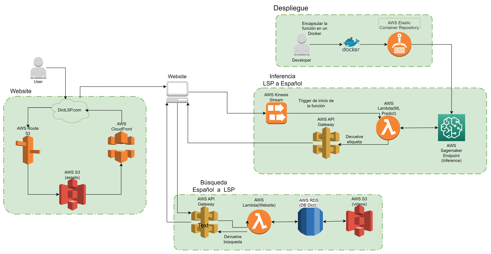

# SpanishToPSLTranslationService

The following document details the process required to deploy the Peruvian Sign Language (PSL) Inference System in AWS.

# Description

Our architecture has the following modules:

* **Website**: It comprehends the website and services related that permits to show our app in a browser (front-end). Here is a [Demo] [Services used: Route 53, S3, CloudFormation]
* **Deployment**: Consists in the services that permits the deployment of the ML model that will allow the inference of our system. [Services used: EC2, Elastic Container Registry(ECR)]
* **Inference PSL/Spanish**: Probably the most import module of our architecture which realizes inferences of video streaming from the website and return as a result the sign or a top 5 of similar signs of PSL. [Services used: Kinesis Video Streams(KVS), Lambda/EC2, API Gateway]
* **Search Spanish/PSL**: It computes a search of signs from a text input of the website. [Services used: API Gateway, Lambda, RDS/DynamoDB, S3]

The diagram of our architecture is showed bellow:

  

As is written before, we are currently evaluating if the inference of video streams will use Lambda, EC2 or even SageMaker.
<!--Links-->
[Demo]: http://lsp-web.s3-website-us-east-1.amazonaws.com/index.html

## How It Works
**User perspective**
1. Enter to the website
2. For text input, enter your search and then click search. For video input, allow the permissions of your camera and record a 5-10 seconds video for ML inference
3. Receive the result of text/video search
4. Learn PSL!

**Front-end perspective**
1. Once the Html/CSS/JS files are ready, there is necessary to upload them to S3, then the S3 bucket is configured to public access, Route 53 and Cloud Formation have to be configured with records info of the hosted domain.

**Back-end perspective**
1. After the training and local test of the ML model there is necessary to configure an EC2 Linux instance to clone this GitHub Repository and create the Docker Image that have to be uploaded to ECR. (For only EC2 inference is necessary configure a webserver in Django)
2. The next step is create a Lambda function using the container image
3. Simultaneously, is necessary configure KVS signalling channel for video streaming and API Gateway to handle communication between front-end and back-end
4. Additionally is necessary configure Lambda functions for text search and the Databases in RDS/DynamoDB.

## References

* [Amazon Kinesis Video Streams SDK](https://github.com/awslabs/amazon-kinesis-video-streams-webrtc-sdk-js)
* [Similar use case](https://github.com/brain-power/Brain-Power-Amazon-Fidgetology)